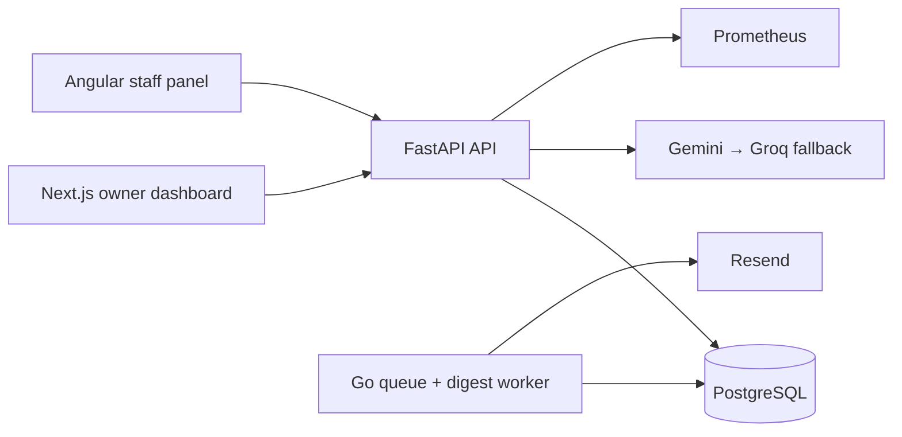

# SME Retail & Inventory Intelligence

CSV-first retail intelligence for small retailers: upload sales and inventory, see per-SKU forecasts and stock alerts, and safely query tenant-scoped data in plain English.

> **Live URL:** configure after Oracle Cloud deployment. **Demo:** add an unlisted YouTube URL after recording the walkthrough.

## Architecture

## Local start

1. Copy `.env.example` to `.env` and set `JWT_SECRET`; add Gemini/Groq/Resend keys for those integrations.
2. Install Docker Desktop, then run `docker compose up --build`.
3. Open owner dashboard at `http://localhost:3000`, staff panel at `http://localhost:4200`, and API docs at `http://localhost:8000/docs`.

Create the first organization/owner through `POST /api/v1/auth/register`. Upload sales CSV (`date,sku,quantity_sold`) and inventory CSV (`sku,stock_on_hand`).

## Security model

Passwords use Argon2, authenticated calls use short-lived signed JWTs, and every tenant query is scoped with the authenticated `organization_id`. The chat service never executes model output directly: it parses SQL, permits only allowlisted read-only tables/columns/functions, injects tenant filters, applies a limit, and writes accepted/rejected audit events. Secrets stay in environment variables/Kubernetes Secrets.

## Production (Oracle Always Free k3s)

Apply `infra/kubernetes` after creating secrets and substituting image names. The stack uses Traefik ingress, cert-manager + DuckDNS/Let's Encrypt TLS, PostgreSQL on a PVC, Prometheus/Grafana, HPA, a digest CronJob, and encrypted backup CronJob uploads to OCI Object Storage. See `infra/kubernetes/README.md` for deployment, DuckDNS update, backup restore-drill, and required credentials.

## Scope

v1 supports one location and CSV imports only. POS/Shopify connections, multi-warehouse, purchasing workflows, and roles beyond owner/staff are intentionally excluded. Prophet is used for adequate history; exponential smoothing handles sparse history. XGBoost is a post-MVP enhancement.

