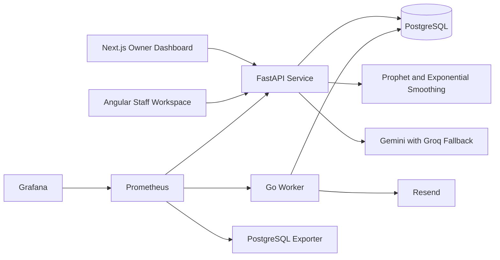

# SME Retail Intelligence

SME Retail Intelligence helps small shops turn ordinary CSV files into useful inventory decisions. Owners can upload sales and stock data, view demand forecasts for each SKU, catch low stock and overstock risks, and ask questions in plain English. The platform does not require Shopify, an ERP, or an internal data team.

## What Is Included

- A Next.js owner dashboard for insights, inventory, forecasts, imports, and chat
- An Angular staff workspace for user access, queued imports, review history, and settings
- A FastAPI service for authentication, tenant data, forecasting, analytics, and secure chat
- A Go worker for queued CSV processing and weekly email digests
- PostgreSQL as the shared system of record
- Docker Compose for local use
- Kubernetes manifests for k3s, HTTPS ingress, scaling, backups, and monitoring
- GitHub Actions for tests, builds, validation, container publishing, and deployment

## Architecture



## Run It Locally

Install Docker Desktop, start Docker, and run these commands from the repository folder:

```powershell
Copy-Item .env.example .env
docker compose up --build
```

The default local environment includes demo data and this demo owner account:

```text
Email: owner@demo.example
Password: RetailDemo123!
```

Open the applications at:

- Owner dashboard: http://localhost:3000
- Staff workspace: http://localhost:4200/admin/
- API documentation: http://localhost:8000/docs
- API metrics: http://localhost:8000/metrics

Stop the platform with `docker compose down`. This keeps the PostgreSQL volume. Use `docker compose down -v` only when you intentionally want to delete all local project data.

## CSV Format

Sales files require these columns:

```csv
date,sku,quantity_sold
2026-07-01,COFFEE-250G,12
```

Inventory files require these columns:

```csv
sku,stock_on_hand
COFFEE-250G,8
```

Recognized optional sales columns are `unit_price`, `product_name`, and `category`. Recognized optional inventory columns are `reorder_point`, `unit_cost`, `product_name`, and `category`.

Imports normalize SKU values, reject negative quantities, report individual row errors, enforce a 5 MB limit, and use content checksums to prevent duplicate imports.

## Main API Routes

| Area | Routes |
| --- | --- |
| Authentication | `POST /api/v1/auth/register`, `POST /api/v1/auth/login`, `GET /api/v1/auth/me` |
| Team | `GET /api/v1/users`, `POST /api/v1/users`, `PATCH /api/v1/users/{id}` |
| Imports | `POST /api/v1/uploads/{kind}`, `GET /api/v1/uploads`, `GET /api/v1/uploads/{id}` |
| Retail data | `GET /api/v1/sales`, `GET /api/v1/inventory`, `GET /api/v1/dashboard` |
| Forecasts | `POST /api/v1/forecasts/{sku}`, `GET /api/v1/forecasts` |
| Assistant | `POST /api/v1/chat` |
| Settings | `GET /api/v1/settings`, `PUT /api/v1/settings` |
| Operations | `GET /health`, `GET /metrics` |

Interactive request and response documentation is available through the local API documentation page.

## Forecasting

Forecast horizons can be set from 7 to 30 days. SKUs with at least eight weeks of daily history use Prophet. Shorter histories use simple exponential smoothing. Recent observations are held back from training so every response can report MAE, RMSE, model name, confidence level, prediction range, and status.

## Secure Chat

The assistant supports these verified question groups:

1. Inventory availability
2. Low stock items
3. Sales by SKU
4. Best and worst movers
5. Demand forecasts and reorder context

Gemini is the primary optional provider and Groq is the fallback. The product also has deterministic offline rules, so the main question groups still work without an API key.

Generated SQL is parsed before use. Only one read only `SELECT` statement over an approved table, column, and function list is accepted. The server adds the authenticated organization filter, applies a 100 row limit and a database timeout, and records accepted or rejected audit events without saving credentials.

## Configuration

Copy `.env.example` to `.env` for local use. Change `JWT_SECRET` and the database password outside local development. LLM and email keys are optional for the offline demo.

| Variable | Purpose |
| --- | --- |
| `DATABASE_URL` | FastAPI PostgreSQL connection |
| `JWT_SECRET` | Access token signing secret |
| `GEMINI_API_KEY` | Primary SQL generation provider |
| `GROQ_API_KEY` | Fallback SQL generation provider |
| `RESEND_API_KEY` | Weekly digest delivery |
| `RESEND_FROM` | Verified sender address |
| `FRONTEND_ORIGIN` | Allowed owner dashboard origin |
| `SEED_DEMO_DATA` | Adds the local demo workspace when true |

## Tests

Run each service directly when developing without Docker:

```powershell
$env:PYTHONPATH="services/api"
$env:DATABASE_URL="sqlite:///./test.db"
.\.venv\Scripts\python.exe -m pytest services\api\tests -q

$env:GOCACHE="$PWD\services\worker\.gocache"
go test ./services/worker/...

npm --prefix apps/owner-web run build
npm --prefix apps/admin-web run build
```

GitHub Actions repeats these tests, builds every container, and validates every Kubernetes manifest on each push and pull request.

## Production Deployment

The production design targets one Oracle Cloud Always Free ARM VM running k3s. The manifests provide Traefik ingress, Let's Encrypt certificates, a PostgreSQL StatefulSet, resource limits, health probes, stateless service autoscaling, weekly digest and encrypted backup jobs, Prometheus, Grafana, and PostgreSQL metrics.

Before the first deployment:

1. Create the VM, install k3s and cert manager, and point a DuckDNS name to the VM.
2. Create the production ConfigMap and Secrets described in `infra/kubernetes/README.md`.
3. Add `KUBECONFIG`, `DUCKDNS_SUBDOMAIN`, and `TLS_EMAIL` as GitHub environment secrets.
4. Run the `Deploy to k3s` workflow.
5. Complete the documented encrypted backup restore drill.

The repository intentionally contains no cloud credentials or fabricated live URL. A public URL and walkthrough video should be added here after the owner supplies the cloud accounts and records the demonstration.

## Project Scope

Version 1 supports one location, CSV imports, and owner or staff roles. POS integrations, Shopify connections, multiple warehouses, and purchase order automation remain future work.

## License

This project is available under the MIT License.
